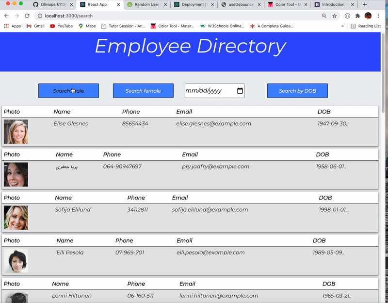

## 19 React_employee_directory_19

## Overview

This is App to create a employee directory with React and break up application's UI into components, manage component state, and respond to user events.

## User Story

* As a user, I want to be able to view my entire employee directory at once so that I have quick access to their information.

## Business Context

An employee or manager would benefit greatly from being able to view non-sensitive data about other employees. It would be particularly helpful to be able to filter employees by name.

## Technologies

### `React`
### `axios`

## API 

[Random User API](https://randomuser.me/), when the user loads the page, a table of employees should render.

## Installation

### `npx create-react-app <app name>` 

### `npm start`

## Demo

